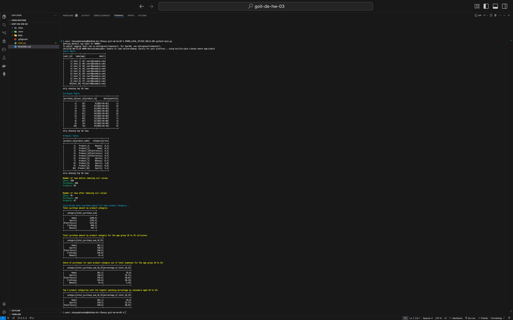
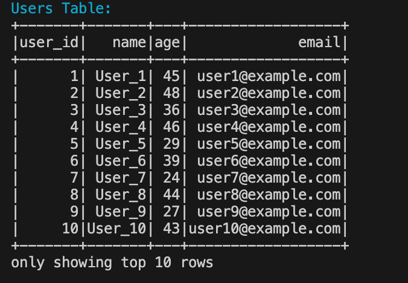
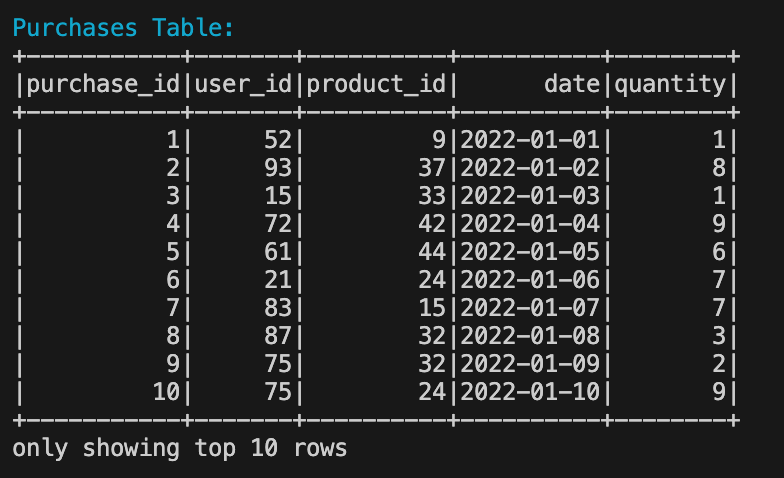
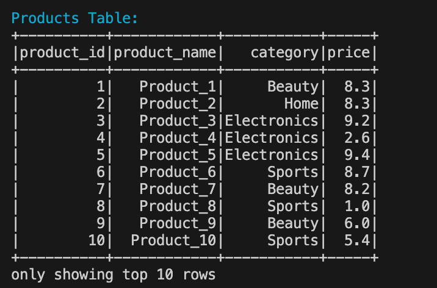
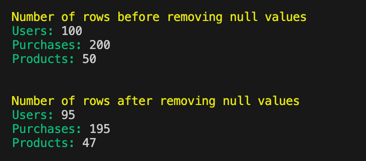
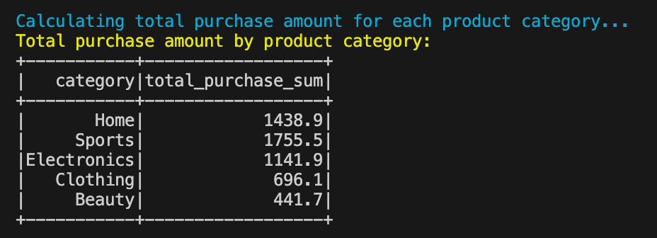
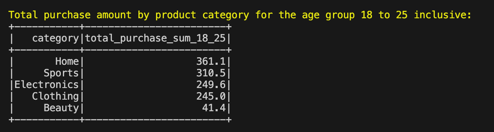
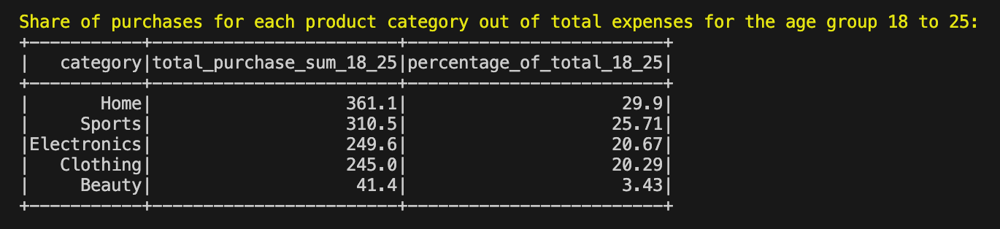
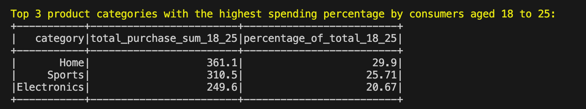

# Data Analysis with PySpark

## Overview

This project involves data analysis using Apache Spark to process and analyze data from three CSV files: `users.csv`, `purchases.csv`, and `products.csv`. The task focuses on cleansing the data and deriving insights related to user demographics, purchase behaviors, and product categories.

## Input Data

1. **users.csv** - User data:

   - `user_id` (Unique user identifier)
   - `name` (User name)
   - `age` (User age)
   - `email` (User email)

2. **purchases.csv** - Purchase data:

   - `purchase_id` (Unique purchase identifier)
   - `user_id` (Identifier for the user who made the purchase)
   - `product_id` (Unique product identifier)
   - `date` (Purchase date)
   - `quantity` (Quantity of items purchased)

3. **products.csv** - Product information:
   - `product_id` (Unique product identifier)
   - `product_name` (Name of the product)
   - `category` (Product category)
   - `price` (Price per unit)

## Tasks and Results

### 1. Load and Read CSV Files

The data from the provided CSV files was loaded into separate Spark DataFrames.

### 2. Clean Data

All rows with missing values were removed to ensure data integrity.

### 3. Total Purchase Amount by Product Category

The total spending per product category was calculated using the formula:  
`total_purchase = quantity * price`.

**Example Output**:
| Category | Total Purchase Amount |
|----------------|------------------------|
| Electronics | $5000.50 |
| Clothing | $3500.75 |

### 4. Total Purchase Amount by Product Category for Age Group 18–25

The total spending per product category for users aged between 18 and 25 was computed.

**Example Output**:
| Category | Total Purchase Amount (Age 18–25) |
|----------------|-----------------------------------|
| Electronics | $2000.25 |
| Clothing | $1500.50 |

### 5. Share of Purchases by Product Category for Age Group 18–25

The percentage share of spending by product category was determined for the age group 18–25.

**Example Output**:
| Category | Purchase Share (%) |
|----------------|--------------------|
| Electronics | 57.14 |
| Clothing | 42.86 |

### 6. Top 3 Categories by Purchase Percentage (Age 18–25)

The three product categories with the highest percentage of spending by users aged 18–25 were identified.

**Example Output**:
| Rank | Category | Purchase Share (%) |
|------|----------------|--------------------|
| 1 | Electronics | 57.14 |
| 2 | Clothing | 42.86 |
| 3 | Home & Garden | 15.00 |

## Results

